### ***Дьяков Иван Михайлович***

# A3. HyperMegaLogLog Pro Max++

Ниже приведен отчет по этапам задания. Структура проекта:
- `c++/` - реализация генераторов и HyperLogLog (C++)
- `python/` - анализ и построение графиков (Python + matplotlib)
- `data/` - CSV-результаты и папки с графиками

---

## Этап 1. Создание инфраструктуры

### 1.1. Генератор потока `RandomStreamGen`
Разработан класс **`RandomStreamGen`** (`c++/RandomStreamGen.h`, `c++/RandomStreamGen.cpp`) для генерации потока данных **S**:
- поток состоит из строк длиной **до 30 символов**;
- допустимые символы: **латинские буквы (A-Z, a-z), цифры (0-9), дефис `-`**;
- реализовано разбиение потока на части (моменты времени **t**) с фиксированным шагом: при `partsCount = 20` получаем `t = 0.05, 0.10, …, 1.00`.

### 1.2. Генератор хэш-функций `HashFuncGen`
Разработан класс **`HashFuncGen`** (`c++/HashFuncGen.h`, `c++/HashFuncGen.cpp`) для генерации хэш-функции **h: U -> M**, где **M = 2^32**:
- на выходе формируется 32-битное значение `uint32_t`;
- `seed` задается параметром запуска, что позволяет получать независимые хэш-функции для экспериментов;
- качество распределения проверяется косвенно через стабильность оценок HLL на нескольких потоках.

---

## Этап 2. Реализация и оценка точности стандартного HyperLogLog

### 2.1. Реализация HyperLogLog
Реализован вероятностный алгоритм **HyperLogLog** для оценки числа уникальных элементов `Nt` в потоке:
- код: `c++/HyperLogLog.h`, `c++/HyperLogLog.cpp`;
- используется массив регистров размера **m = 2^p**;
- индекс регистра берется по первым `p` бит хэша, остальная часть используется для вычисления `ρ(w)` (позиция первого `1`);
- применены стандартные поправки:
  - константа **α_m**,
  - **small-range**: linear counting,
  - **large-range** correction.

### 2.2. Экспериментальная постановка
Для оценки точности выполнены прогоны на нескольких потоках:
- число потоков: **30**;
- длина каждого потока: **200000** элементов;
- разбиение по времени: `partsCount = 20` (шаг **5%**, `t = 0.05 … 1.00`);
- проверены несколько значений параметра `p` (и, соответственно, `m = 2^p`):
  - `p=8` -> `m=256`
  - `p=10` -> `m=1024`
  - `p=12` -> `m=4096`

Точное число уникальных элементов `F0t` вычисляется напрямую для каждого `t` через `unordered_set` (это используется как «истина» для сравнения).

Результаты сохраняются в CSV-файлы `data/results_p{p}.csv` со столбцами:
`stream_id, step, fraction, processed, true_f0, estimate`.

### 2.3. Графики

### График 1: сравнение `Nt` и `F0t`
Ось X: доля потока `t`.  
Ось Y: число уникальных элементов.  
На графике две линии: **истинное `F0t`** и **оценка HLL `Nt`**.

**p = 8**
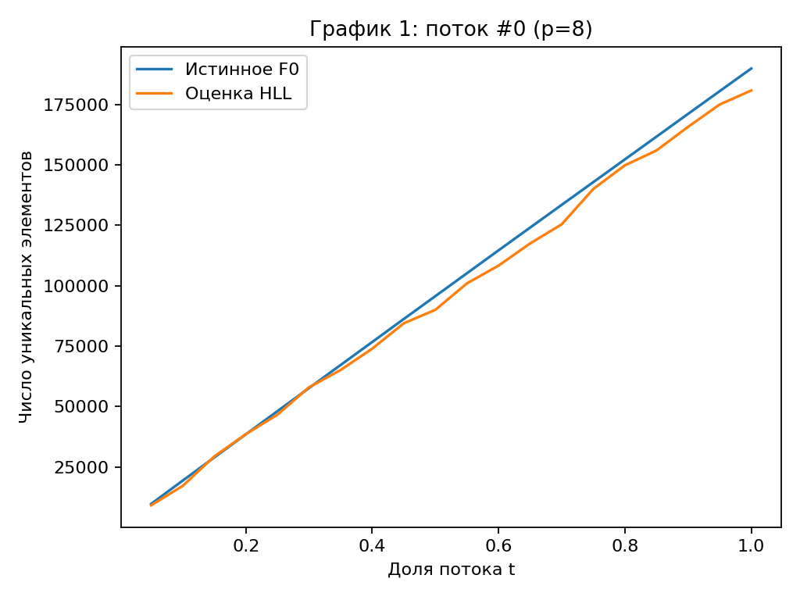

**p = 10**
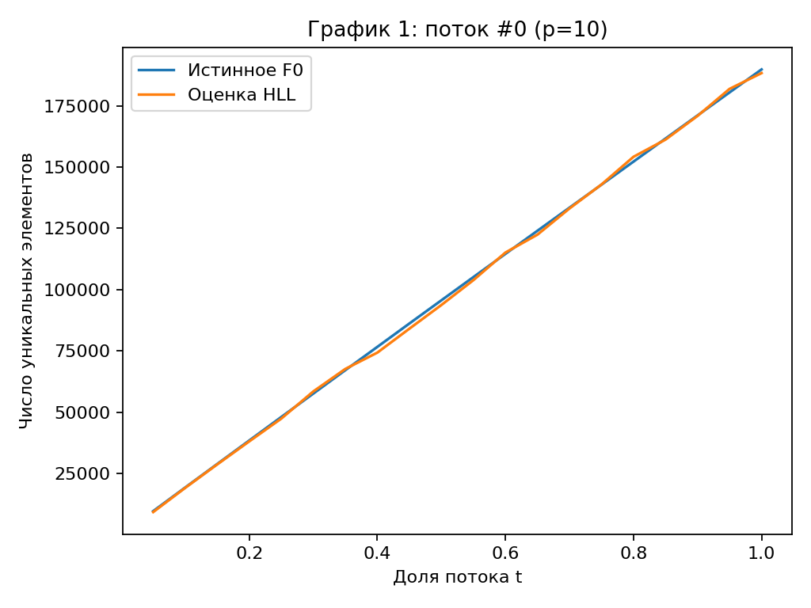

**p = 12**

### График 2: статистики оценки
Для всех потоков вычислены:
- средняя оценка **E(Nt)**,
- стандартное отклонение **σNt**,
и построена область неопределенности **E(Nt) ± σNt**.

**p = 8**
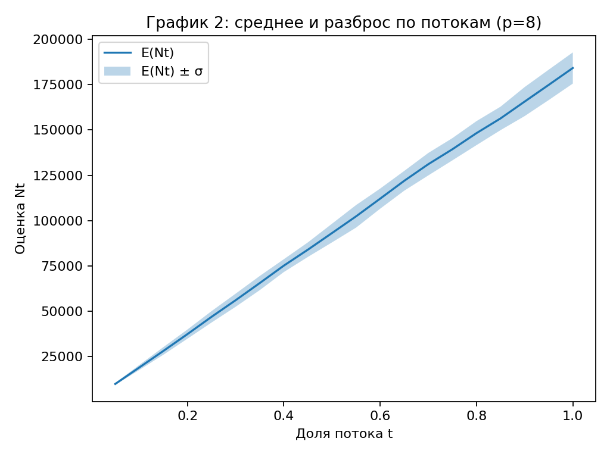

**p = 10**
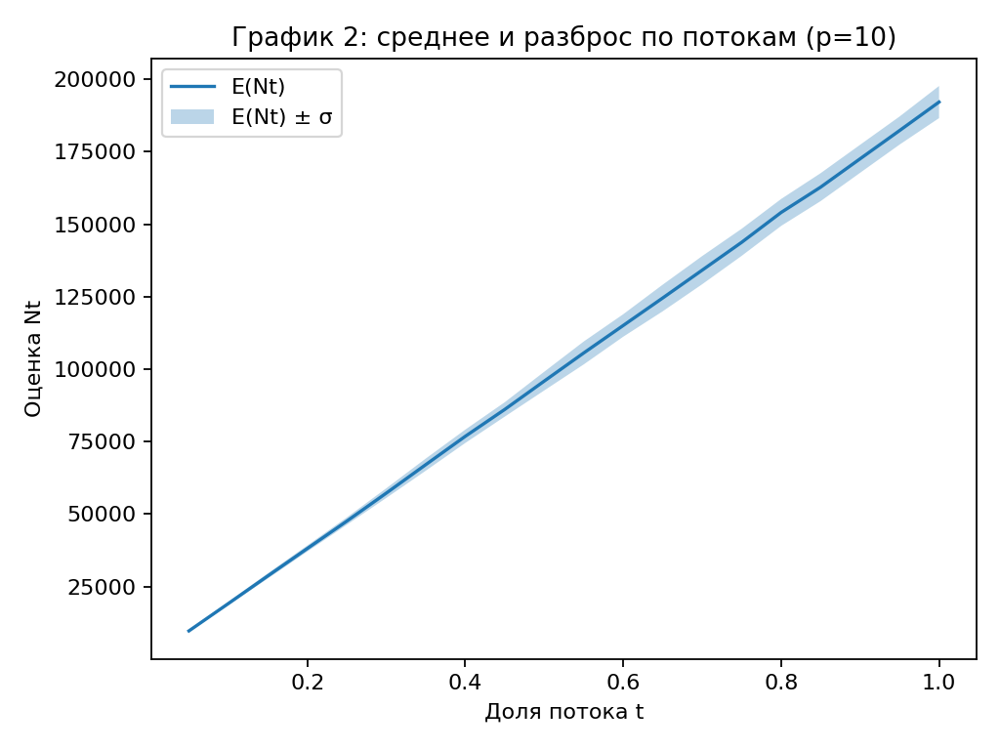

**p = 12**
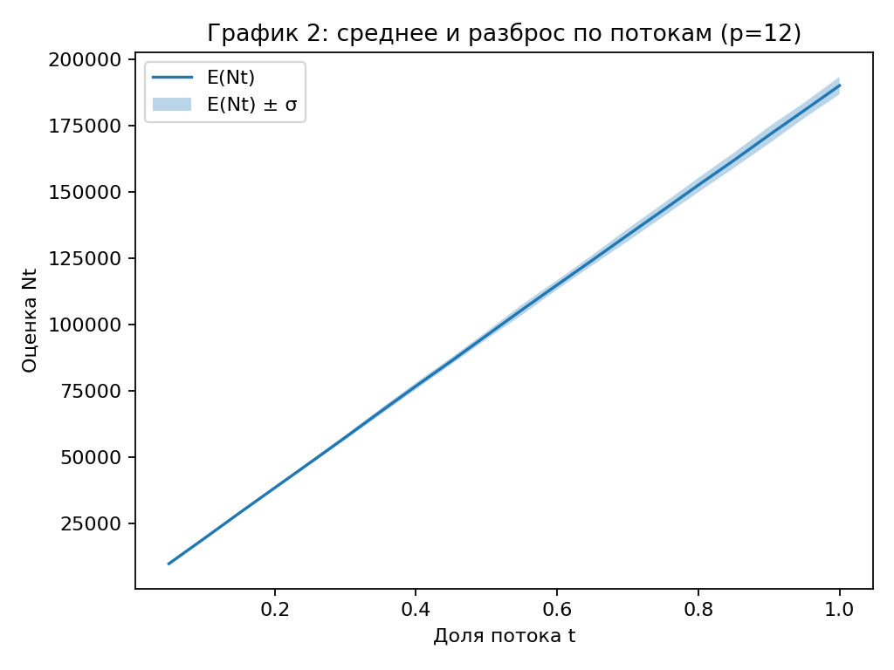

---

## Этап 3. Анализ результатов стандартного HyperLogLog

### 3.1. Точность (смещение)
По итогам прогонов относительная ошибка на полном потоке (`t = 1.0`) получилась:

- `p=8 (m=256)`: средняя относительная ошибка ≈ **-0.030**
- `p=10 (m=1024)`: средняя относительная ошибка ≈ **+0.012**
- `p=12 (m=4096)`: средняя относительная ошибка ≈ **+0.001**

Вывод: при росте `m` (то есть `p`) смещение уменьшается, оценка становится ближе к истинному значению.

### 3.2. Стабильность оценки (дисперсия)
Стандартное отклонение относительной ошибки на полном потоке (`t = 1.0`):

- `p=8 (m=256)`: σ ≈ **0.045**
- `p=10 (m=1024)`: σ ≈ **0.029**
- `p=12 (m=4096)`: σ ≈ **0.018**

Вывод: увеличение `m` снижает разброс оценок (оценка становится стабильнее).

### 3.3. Сравнение с теорией
Сравниваем σ относительной ошибки с ориентиром:
`1.04 / sqrt(m)`, где `m = 2^p`.

- `p=8, m=256`: `1.04/√256 = 0.065`, наблюдаем σ≈0.045 -> **в пределах**
- `p=10, m=1024`: `1.04/√1024 = 0.0325`, σ≈0.029 -> **в пределах**
- `p=12, m=4096`: `1.04/√4096 = 0.01625`, σ≈0.018 -> **очень близко**, при сравнении с более мягкой оценкой `1.3/√m` точно укладывается.

### График 3: ошибки и теория
Построены зависимости по `t`:
- средняя относительная ошибка,
- σ относительной ошибки,
- теоретическая линия `1.04 / sqrt(m)`.

**p = 8**
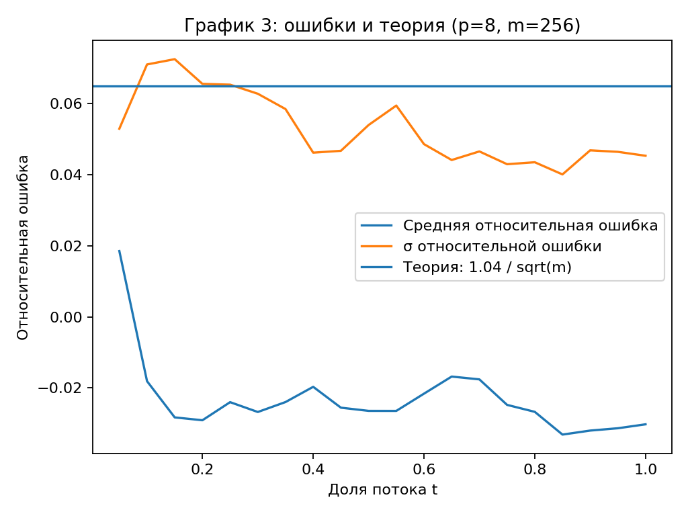

**p = 10**
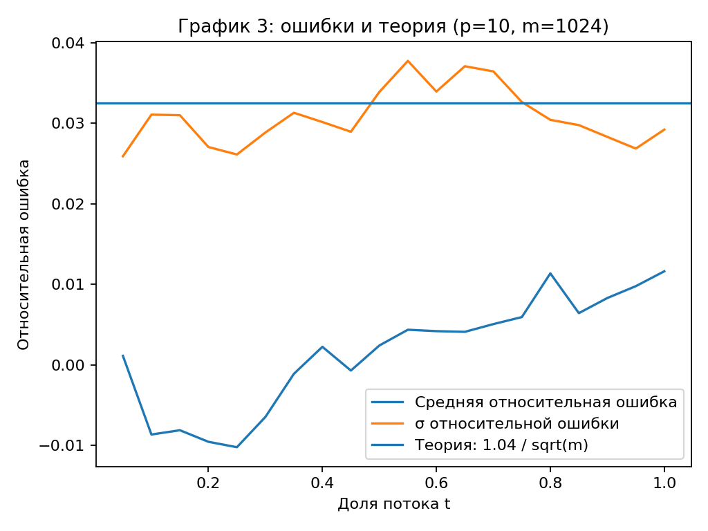

**p = 12**
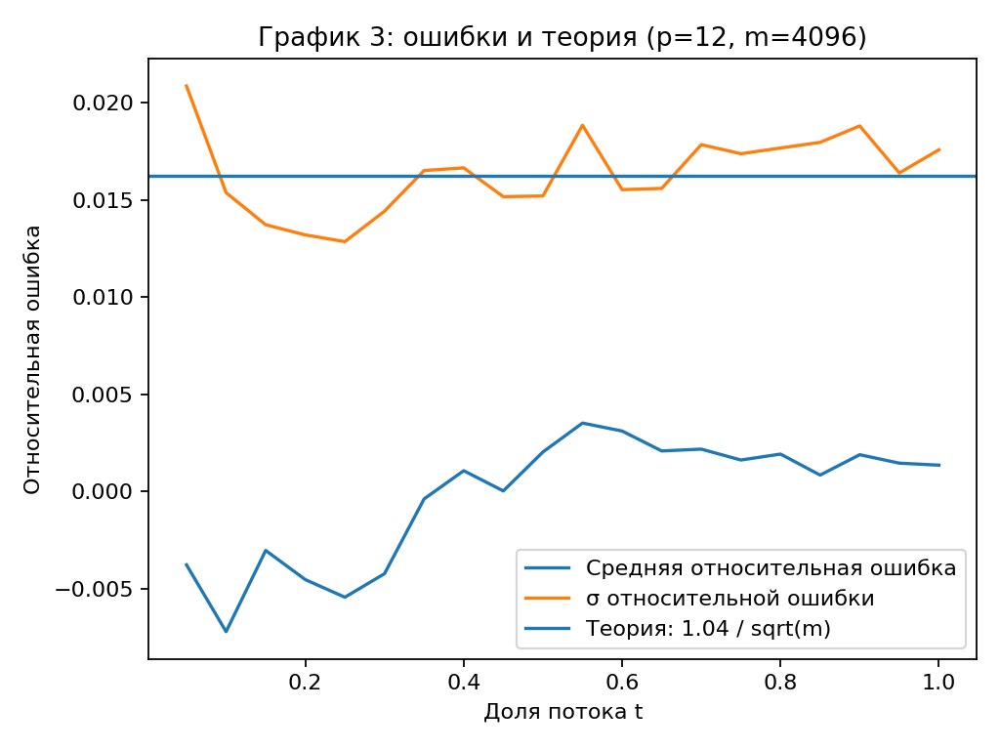

### 3.4. Эффективность выбранных констант/поправок
В реализации использованы стандартные элементы HLL:
- `α_m` нормирует оценку для заданного числа регистров;
- linear counting уменьшает смещение на малых мощностях множества (когда много нулевых регистров);
- large-range correction корректирует поведение при очень больших мощностях.

Это снижает систематическое смещение и делает поведение ближе к теоретически ожидаемому.

---

## Этап 4. Усовершенствование HyperLogLog

### 4.1. Идея улучшения
Для уменьшения дисперсии реализована улучшенная версия оценки:
- запускаются **k независимых HyperLogLog-скетчей** (разные `seed` у хэш-функции),
- итоговая оценка берется как **медиана** из `k` оценок.

Режим реализован в `c++/main.cpp` как `mode = med`. В экспериментах использовано **k=5** (файлы `results_med5_*`).

Плюсы: меньше влияние выбросов -> меньше дисперсия.  
Минусы: память и время растут примерно в **k раз**.

### 4.2. Повтор Этапа 2: результаты для улучшенного алгоритма
Результаты сохранены в:
- `data/results_med5_p8.csv`
- `data/results_med5_p10.csv`
- `data/results_med5_p12.csv`

Построены графики сравнения “база vs улучшенный”.

### Сравнение: График 1 (поток #0)

**p = 8**
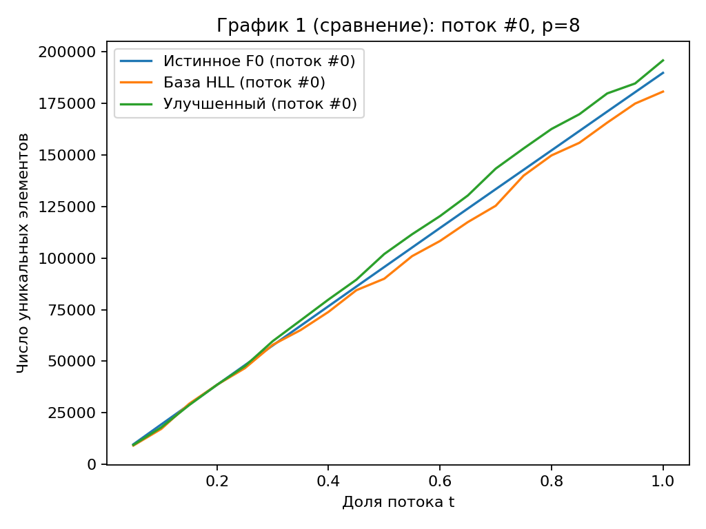

**p = 10**
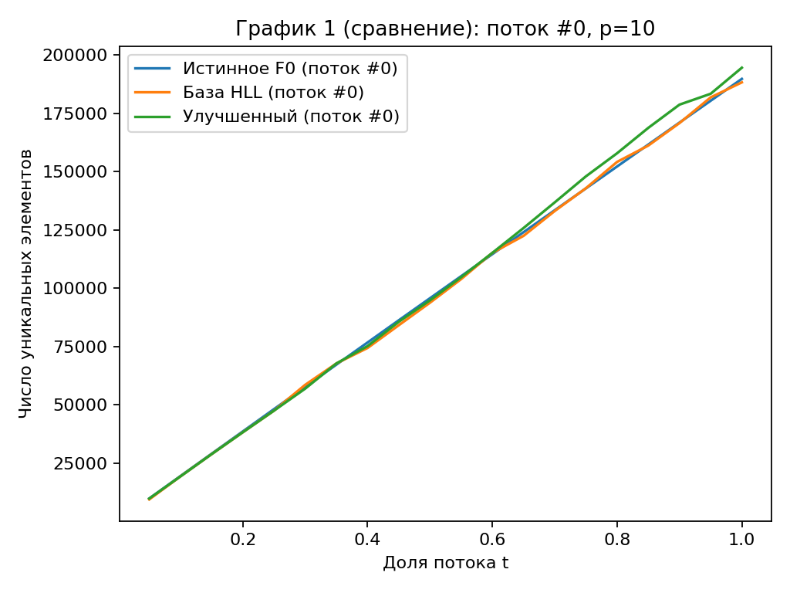

**p = 12**
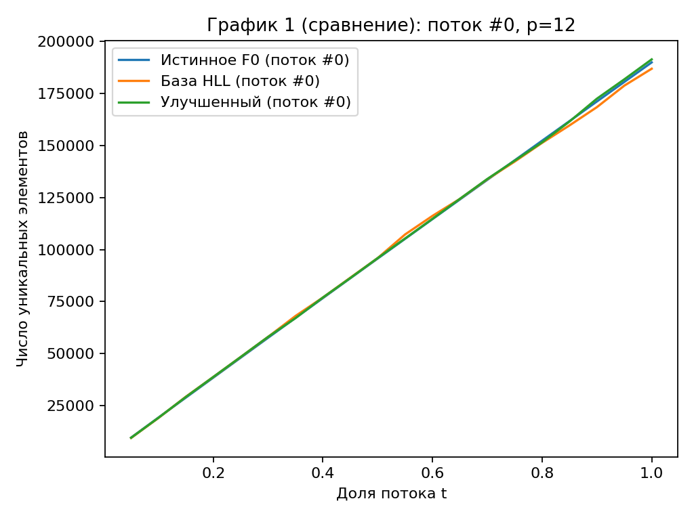

### Сравнение: График 2 (E(Nt) и σ)

**p = 8**
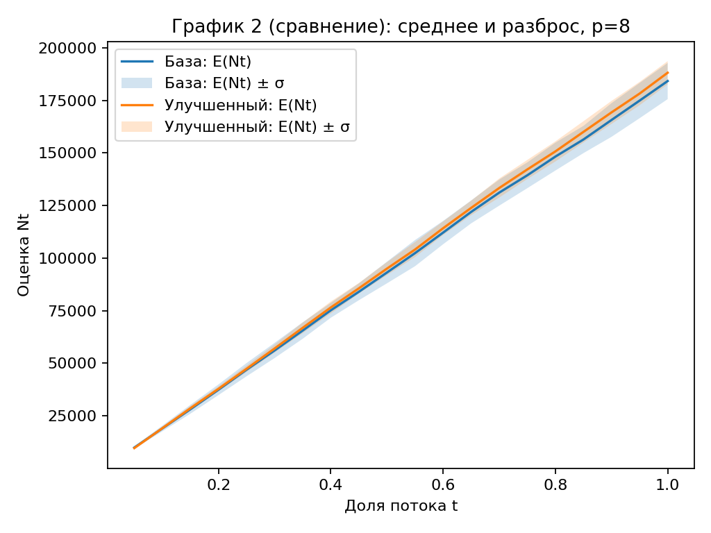

**p = 10**
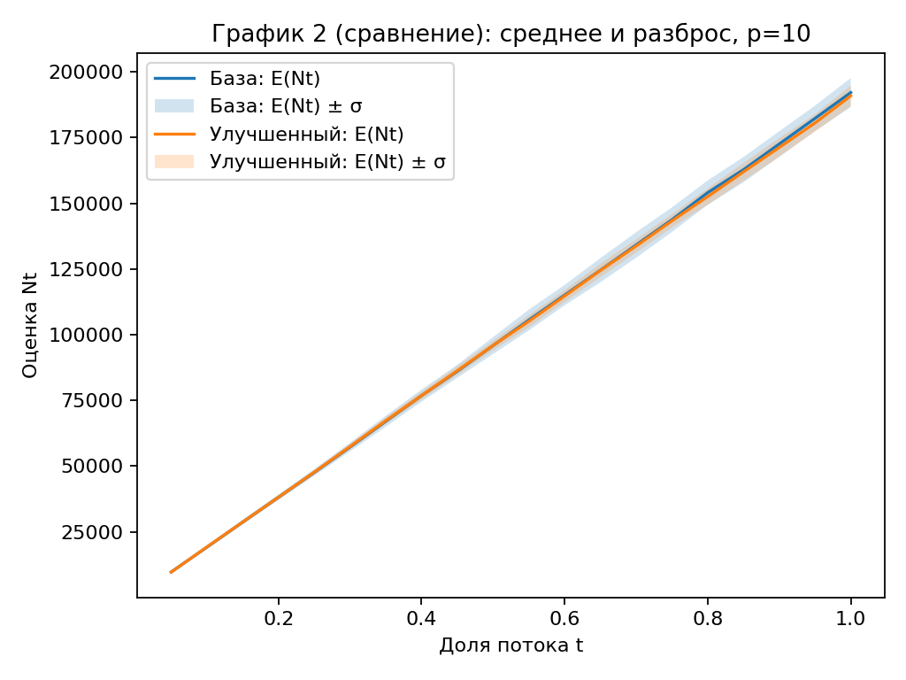

**p = 12**
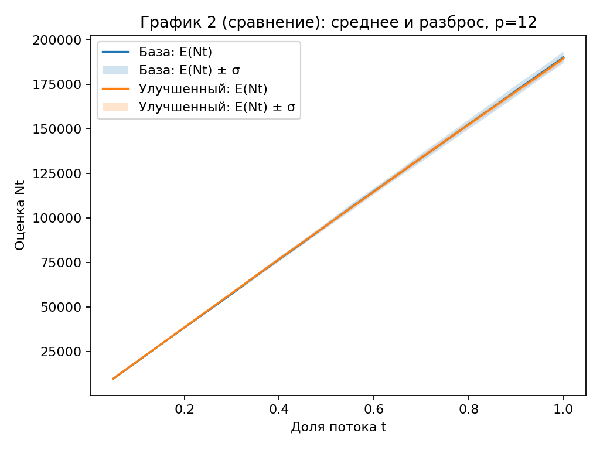

### 4.3. Повтор Этапа 3: анализ улучшенного алгоритма
По итогам (`t = 1.0`) дисперсия заметно снизилась:

- `p=8`: σ было **0.045**, стало **0.029**
- `p=10`: σ было **0.029**, стало **0.021**
- `p=12`: σ было **0.018**, стало **0.010**

Средняя относительная ошибка осталась небольшой по модулю, но может немного смещаться.

### Сравнение σ относительной ошибки

**p = 8**
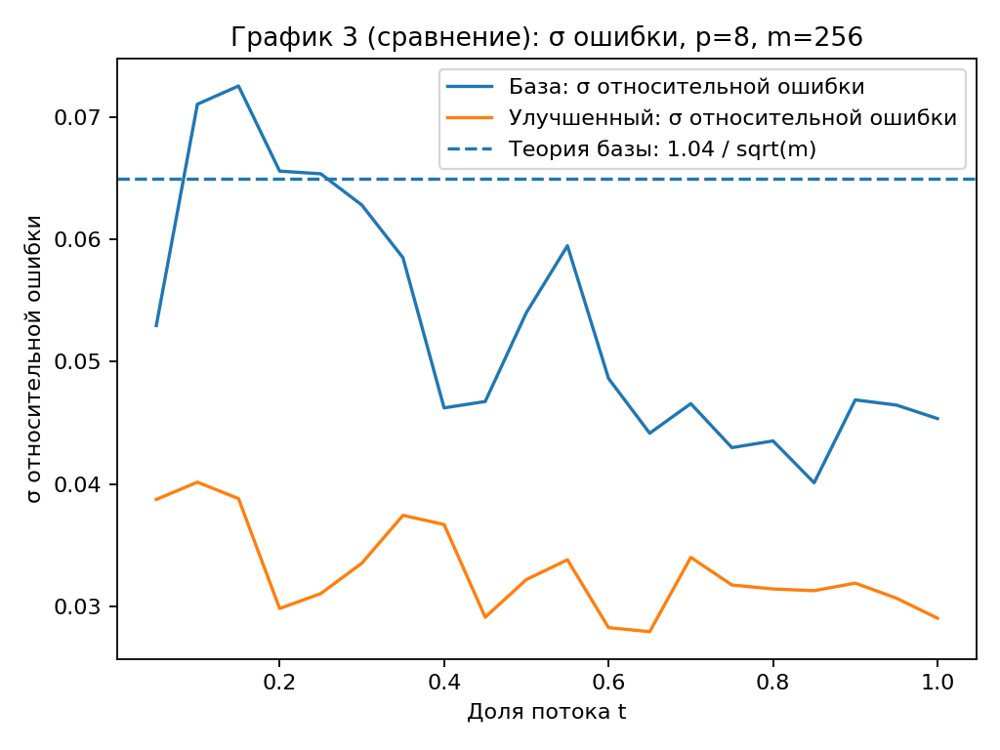

**p = 10**

**p = 12**
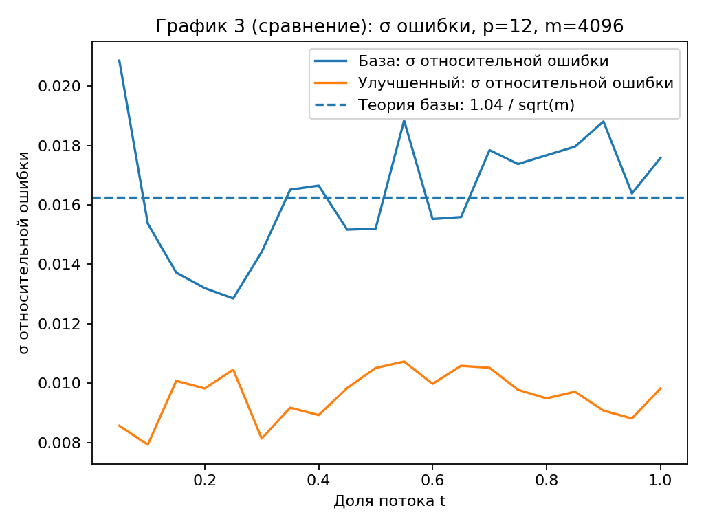

### 4.4. Потребление памяти
В базовом HLL хранится `m = 2^p` регистров (в реализации - 1 байт на регистр), то есть примерно:
- `p=8`: ~256 байт
- `p=10`: ~1024 байт
- `p=12`: ~4096 байт

В улучшенной версии (`k=5`) память увеличивается примерно в **5 раз**:
- `p=8`: ~1280 байт
- `p=10`: ~5120 байт
- `p=12`: ~20480 байт
